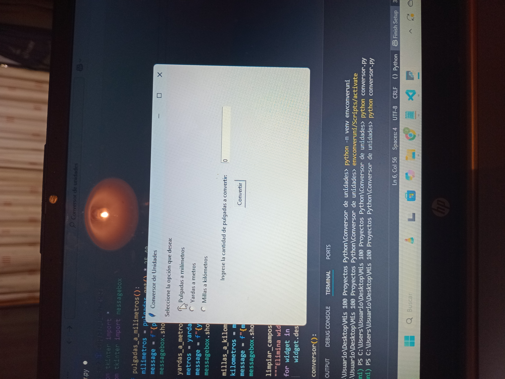
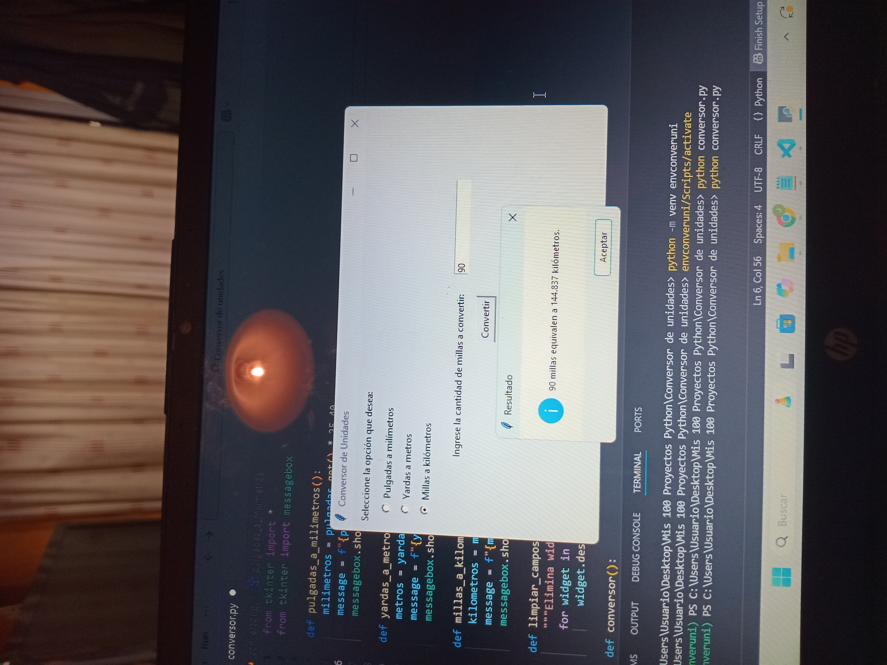
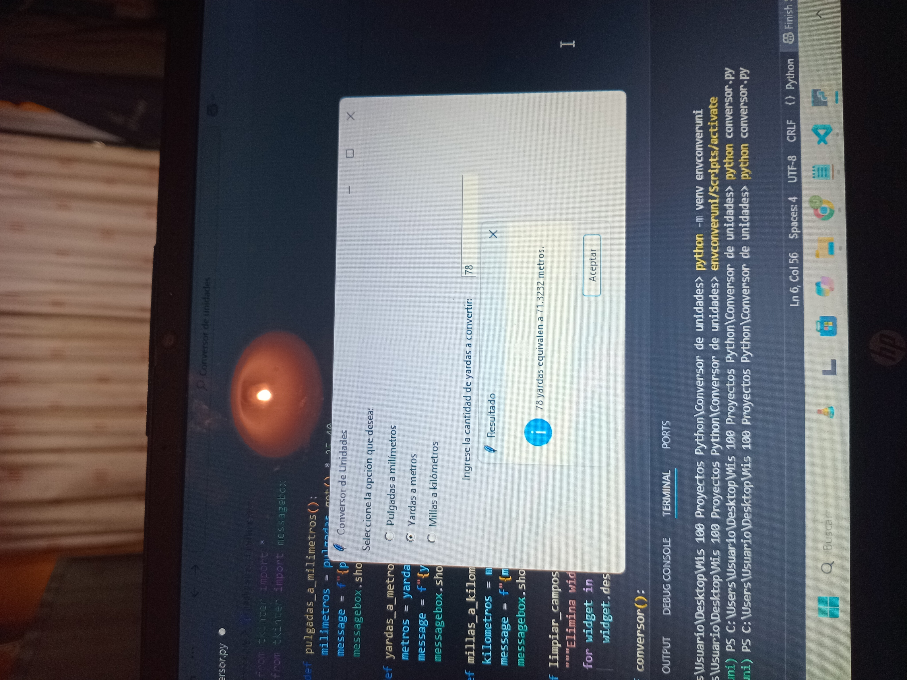
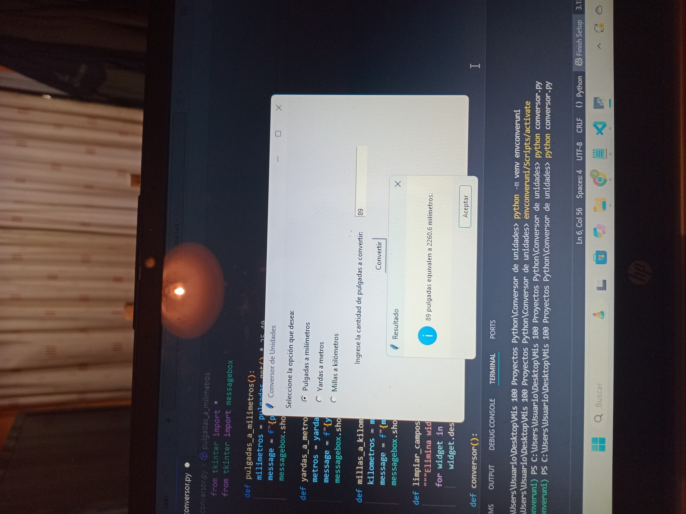

# 🔢 Python Unit Converter (Tkinter)

A simple **Unit Converter** built with **Python and Tkinter**.  
It allows users to convert between:  

- 📏 Inches ➝ Millimeters  
- 📐 Yards ➝ Meters  
- 🌍 Miles ➝ Kilometers  

---

## 🚀 Features
- Intuitive **graphical interface** with radio buttons to select conversion type.  
- Easy input fields for user values.  
- Quick conversion with results shown in pop-up messages.  
- Lightweight and fast Python application.  

---

## 🖼️ Screenshots  

Here are some screenshots of the app in action:  

  
  
  
  
  

---

## ⚙️ Installation  

1. Clone this repository:  
   ```bash
   git clone https://github.com/your-username/python-unit-converter.git

2. Navigate to the project folder:

   cd python-unit-converter

3. Run the program:

   python conversor.py
